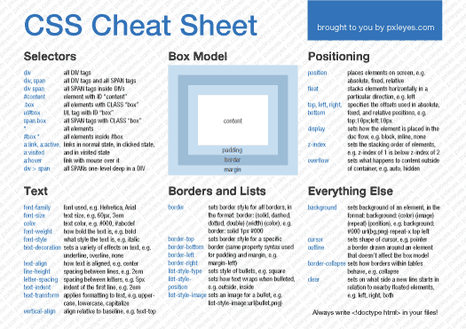

# css

* css cheatsheet

* css를 이용한 간단한 게임
  	* [css게임](flukeout.github.io)
		17번까지는 해보기
		그 뒤는 그냥 해보기
			-> 궁금하면 생활코딩 css 다양한 선택자들 보기

* 사이즈 조정
	* px vs em vs rem(rem이 가장 최근에 나온 것)->절대적이냐 상대적이냐의 차이

		* px은 고정된 폰트(절대적)

		* rem과em은 가변된 폰트(상대적)

	이중 rem이 가장 좋다
	왜냐하면 폰트크기를 조정할수 있는 사용자의 권리를 보장해 준다.

* color
	* color를 지정하는 방식은 3가지
		* color name
		* hex  ->16진수 방식(#~~)
		* rbg

* [color 비교 사이트](www.w3schools.com)
	-> 컬러를 보기에 좋다

  	* color name은 tomato나skyblue이런식으로 유명한 색은 지정되어 잇다.
 .
* text-align (텍스트 정렬하기)
	* justify ->양쪽을 균둥하게
	* left 나 right면 한족에 치우친다.

font-family ->폰트지정
