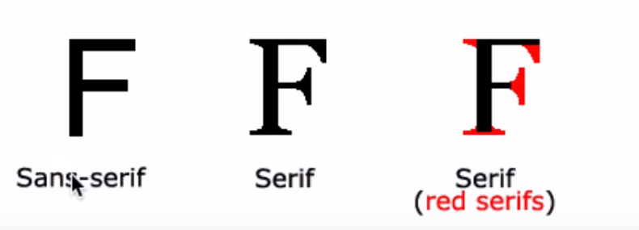

# css(cascading style sheet)

* css cheatsheet

* css를 이용한 간단한 게임
  	* css게임 -> flukeout.github.io
		17번까지는 해보기
		그 뒤는 그냥 해보기
			-> 궁금하면 생활코딩 css 다양한 선택자들 보기

* 사이즈 조정
	* px vs em vs rem(rem이 가장 최근에 나온 것)->절대적이냐 상대적이냐의 차이

		* px은 고정된 폰트(절대적)

		* rem과em은 가변된 폰트(상대적)

	이중 rem이 가장 좋다
	왜냐하면 폰트크기를 조정할수 있는 사용자의 권리를 보장해 준다.

* color
	* color를 지정하는 방식은 3가지
		* color name
		* hex  ->16진수 방식(#~~)
		* rbg

* color 비교 사이트->www.w3schools.com
	-> 컬러를 보기에 좋다

  	* color name은 tomato나skyblue이런식으로 유명한 색은 지정되어 잇다.
 -------------------------------------------------------------------------------
* text-align (텍스트 정렬하기)
	* justify ->양쪽을 균둥하게
	* left 나 right면 한족에 치우친다.
--------------------------------------------------------------------------------
* font-family ->폰트지정
  * font-family: 폰트1, 폰트2, 폰트3
      우선 순위의 폰트가 뜬다 (폰트1이 없으면 폰트2 또 없으면 폰트3)
--------------------------------------------------------------------------------
* font shape

  

      * Sans-serif (장식이 없다)
      * monospace (고정목)
      * Serif (장식이 있다)
      * cursive (흘림체)
      * fantasy

  * line-height -> (글자)줄 사이 간격[상대적 수치 사용하기]

  * font: font-style font-variant font-weight font-size/line-height
  ,font-family|caption|icon|menu|message-box|small-caption|status-bar|initial|inherit;
      * ex) font: 15px arial, sans-serif;
--------------------------------------------------------------------------------
* 상속

    * 부모의 (컬러,상태 등등)을 자식이 물려받는것이 가장 효율적이다.(더 적은 코드로 작성이 가능)
    * 특정 태그에 효과를 주고 싶으면 id나 class이용
      * 하지만 부모에게서 상속을 받을경우
        css의 여러 속성이 모두 상속 되는 것이 아니라 상속이 되었을때 유리한 (ex폰트컬러) 유리하지 않은 (ex테두리) 와 같이 구분해 상속 한다.
          * 상속되는 것과 상속되지 않는 속성은 상속표를 보고 구분하면 된다.  
--------------------------------------------------------------------------------
* cascading(캐스 캐이딩)

  *웹을 잘 만들기 위해서 우선순위가 필요
    1.웹브라우저 < 사용자 <저자

    2.style attrubute< id < class < tag
      * 지금 디자인 하는 부분에 뭐가 더 정확하고,구체적이며 더 포괄적이며, 일반적인지 이러한 이유를 따졌을때 저 우선 순위를 따른다.
        *하지만 모든 우선순위를 뛰어넘는 방법이 있다. (!important 사용)
            ㄴ> 좋은 방법은 아니니 우선순위를 잘따지자
